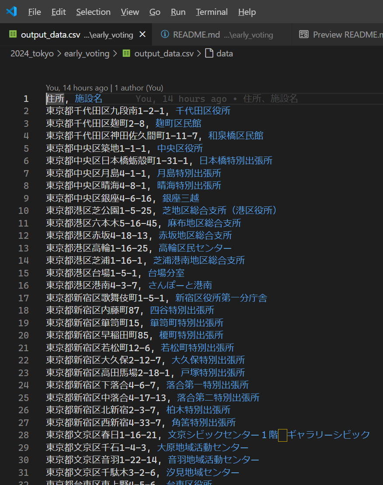

# ［東京都選挙管理委員会　＞　期日前投票所一覧　Ｗｅｂページ］の投票所一覧をＣＳＶに変換するＰｙｔｈｏｎスクリプト


## 入力データ

  

📖 [東京都選挙管理委員会　＞　期日前投票所一覧　Ｗｅｂページ](https://r6tochijisen.metro.tokyo.lg.jp/vote/index.html)  

👆　リンクをクリックして、開いたＷｅｂページで `[Ctrl] + [A]` キーを押すなどして全文選択して `[Ctrl] + [C]` キーを押すなどしてコピー  

  

👆　📄 `input_data.txt` という名前のテキストファイルへその内容を貼り付け


## ＣＳＶ変換の実行

  

例えば以下の通り  

```shell
cd 2024_tokyo/early_voting
python make_csv.py
```


## 出力データ

  

👆　📄 `output_data_early_voting.csv` 参照


## グーグルマップへのインポート

別サイトの記事を参考にしてください  

* 📖 [住所のCSVファイルをインポートする](https://diamond.jp/articles/-/308329?page=2)  
