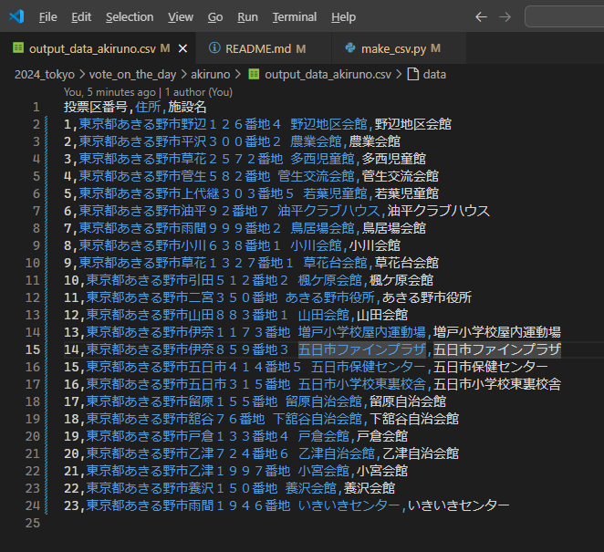

# ［東京都選挙管理委員会　＞　（当日の）投票所一覧　＞　あきる野市　Ｗｅｂページ］の投票所一覧をＣＳＶに変換するＰｙｔｈｏｎスクリプト


# 入力データ

  

* 📖 [東京都選挙管理委員会事務局　＞　都内区市町村選管等問い合わせ先](https://www.senkyo.metro.tokyo.lg.jp/kushichoson-contact/)
  * 地図内： あきる野市　から　📖 [東京都選挙管理委員会　＞　（当日の）投票所一覧　＞　あきる野市　ＰＤＦ](https://www.city.akiruno.tokyo.jp/cmsfiles/contents/0000016/16948/youhyoukuitiran.pdf)  

👆　リンクをクリックして、開いたＷｅｂページで `[Ctrl] + [A]` キーを押すなどして全文選択して `[Ctrl] + [C]` キーを押すなどしてコピー  

  

👆　📄 `input_data.txt` という名前のテキストファイルへその内容を貼り付け


## ＣＳＶ変換の実行

  

例えば以下の通り  

```shell
cd 2024_tokyo/vote_on_the_day/akiruno
python make_csv.py
```


## 出力データ

  

👆　📄 `output_data_akiruno.csv` 参照


## グーグルマップへのインポート

別サイトの記事を参考にしてください  

* 📖 [住所のCSVファイルをインポートする](https://diamond.jp/articles/-/308329?page=2)  
