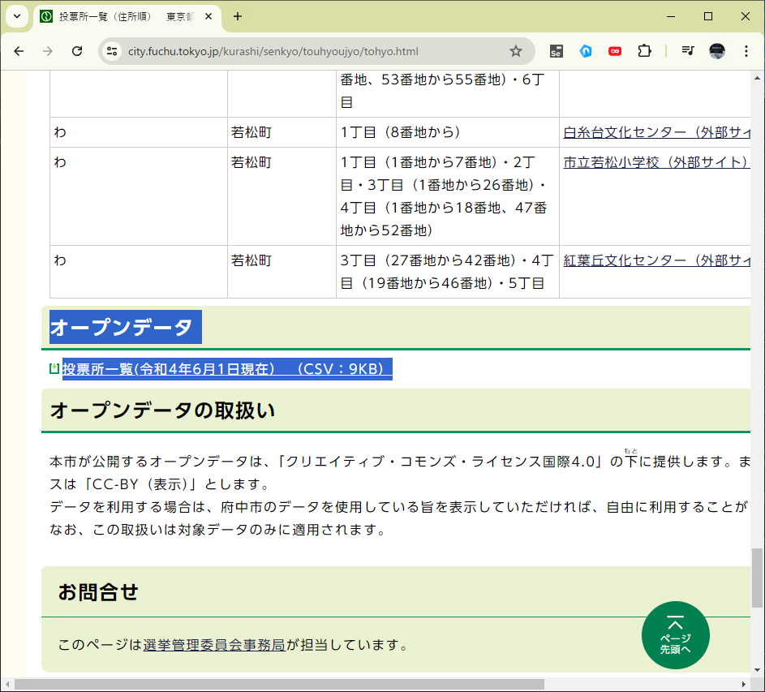
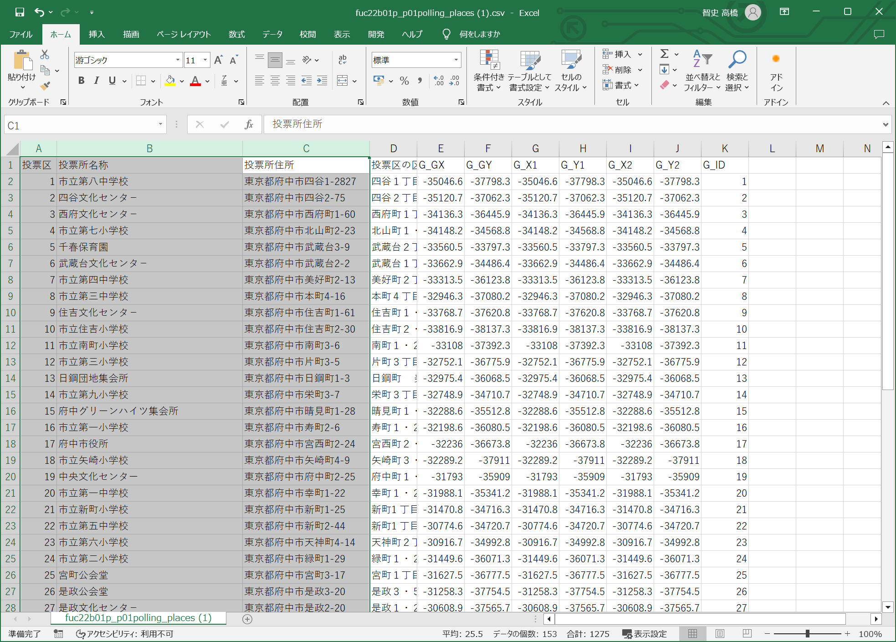
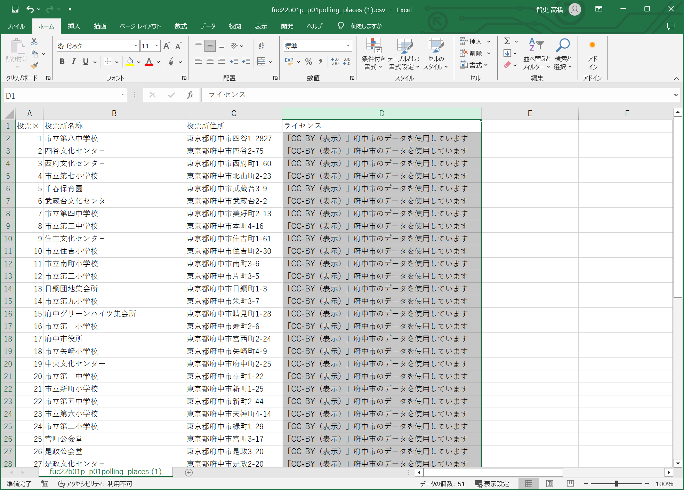
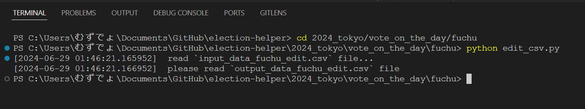
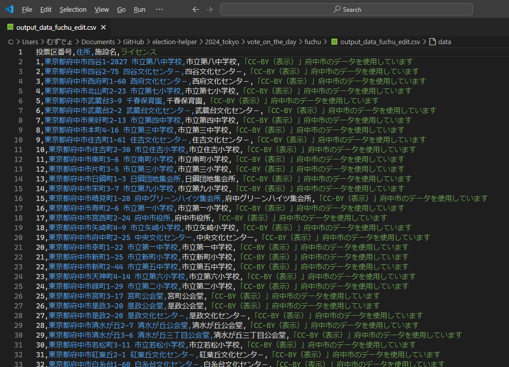

# ［東京都選挙管理委員会　＞　（当日の）投票所一覧　＞　府中市　Ｗｅｂページ］の投票所一覧ＣＳＶを編集するＰｙｔｈｏｎスクリプト


# 入力データ

  

* 📖 [東京都選挙管理委員会事務局　＞　都内区市町村選管等問い合わせ先](https://www.senkyo.metro.tokyo.lg.jp/kushichoson-contact/)
  * 地図内： 府中市　から　📖 [東京都選挙管理委員会　＞　（当日の）投票所一覧　＞　府中市　Ｗｅｂページ](https://www.city.fuchu.tokyo.jp/kurashi/senkyo/touhyoujyo/tohyo.html)  

👆　リンクをクリックして、ＣＳＶファイルを取得できます  

  

👆　ＣＳＶファイルの欲しい列だけ残します  

  

👆　ライセンスを表示する良い方法がないので列を足してみます。 📄 `input_data_fuchu_edit.csv` という名前で保存  


## ＣＳＶ変換の実行

  

例えば以下の通り  

```shell
cd 2024_tokyo/vote_on_the_day/fuchu
python edit_csv.py
```


## 出力データ

  

👆　📄 `output_data_fuchu_edit.csv` 参照


## グーグルマップへのインポート

別サイトの記事を参考にしてください  

* 📖 [住所のCSVファイルをインポートする](https://diamond.jp/articles/-/308329?page=2)  
