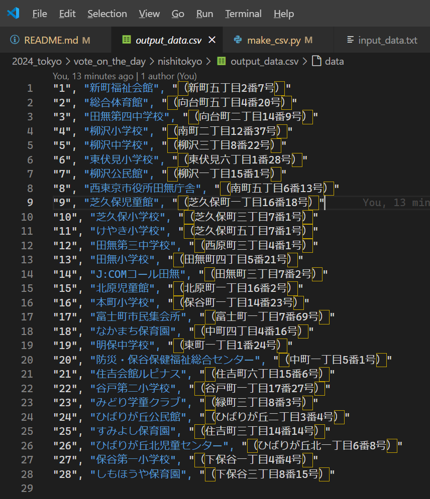

# ［東京都選挙管理委員会　＞　（当日の）投票所一覧　＞　西東京市　Ｗｅｂページ］をＣＳＶに変換するスクリプト


# 入力データ

  

* 📖 [東京都選挙管理委員会事務局　＞　都内区市町村選管等問い合わせ先](https://www.senkyo.metro.tokyo.lg.jp/kushichoson-contact/)
  * 地図内： 西東京市　から　📖 [東京都選挙管理委員会　＞　（当日の）投票所一覧　＞　西東京市　Ｗｅｂページ](https://www.city.nishitokyo.lg.jp/siseizyoho/senkyo/touhyoujo.html)  

👆　リンクをクリックして、開いたＷｅｂページで `[Ctrl] + [A]` キーを押すなどして全文選択して `[Ctrl] + [C]` キーを押すなどしてコピー  

  

👆　📄 `input_data.txt` という名前のテキストファイルへその内容を貼り付け


## ＣＳＶ変換の実行

  

例えば以下の通り  

```shell
cd 2024_tokyo/vote_on_the_day/nishitokyo
python make_csv.py
```


## 出力データ

  

👆　📄 `output_data.txt` 参照
